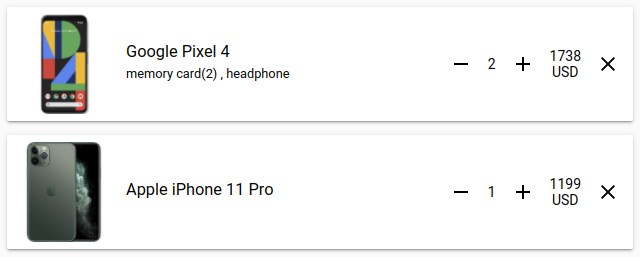
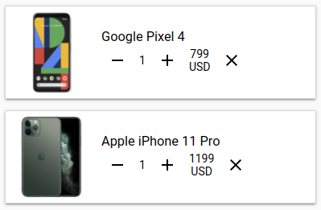

[](https://www.webcomponents.org/element/wise-shopping-cart)
# \<wise-shopping-cart\>

Responsive shopping cart by [WiseHands](https://wisehands.me)

### It contains:
- image
- name 
- quantity 
- price 
- increase/decrease quantity buttons 
- remove item from cart button 

### Desktop view


### Mobile view


## Viewing Demo

```
$ npm install
$ polymer serve
```

# How to use

You can see usage in `demo-wise-shopping-cart.js`

### Notes

Product images should have 1:1 ratio.

To initialize use this JSON to fill values:

```
<wise-shopping-cart cart-items="[[cartItems]]"></wise-shopping-cart>

[
    {
        "uuid": "8",
        "name": "Google Pixel 4",
        "imagePath": "demo1.jpg",
        "quantity": 1,
        "price": 799,
        "additionList": [
          {
            "uuid": "401",
            "title": "memory card",
            "price": 25,
            "quantity": 2,
            "imagePath": "http://localhost:3334/public/product_images/402881ce7010f488017010f495ef000b//public/files/402881ce7010f488017010f495ef000b/9746a26d-ea5d-4bac-b1f4-6a77994ffded.jpg"
          },
          {
            "uuid": "402",
            "title": "headphone",
            "price": 20,
            "quantity": 1,
            "imagePath": "http://localhost:3334/public/product_images/402881ce7010f488017010f495ef000b//public/files/402881ce7010f488017010f495ef000b/9746a26d-ea5d-4bac-b1f4-6a77994ffded.jpg"
          }
        ]
    },
    {
        "uuid": "16",
        "name": "Apple iPhone 11 Pro",
        "imagePath": "demo2.jpg",
        "quantity": 1,
        "price": 1199,
        "additionList": []
    }
]
```
There are events available: 

- `increase-item-quantity`
- `decrease-item-quantity`
- `remove-item`
- `open-product`

```
document.addEventListener('remove-item', function (e) {
   console.log("remove item clicked, add your handler to invoke api or change value in other storage", e.detail);
})
document.addEventListener('decrease-item-quantity', function (e) {
   console.log("decrease item quantity clicked, add your handler to invoke api or change value in other storage", e.detail);
})
document.addEventListener('increase-item-quantity', function (e) {
   console.log("increase item quantity clicked, add your handler to invoke api or change value in other storage", e.detail);
})

document.addEventListener('start-shopping', function (e) {
   console.log("in empty basket, start shopping button was clicked", e.detail);
})

document.addEventListener('open-product', function (e) {
   console.log("click on title product or image for open product page", e.detail);
})

```
